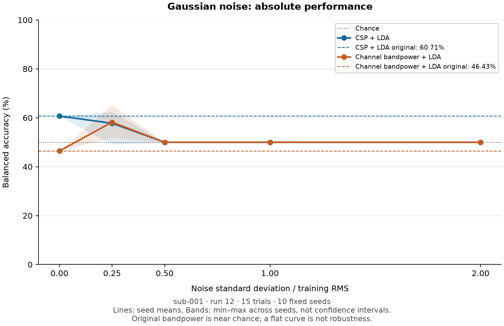
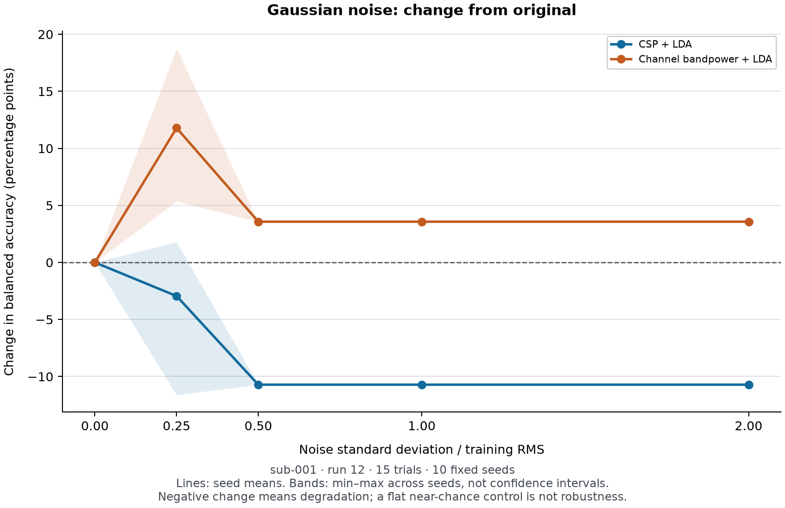
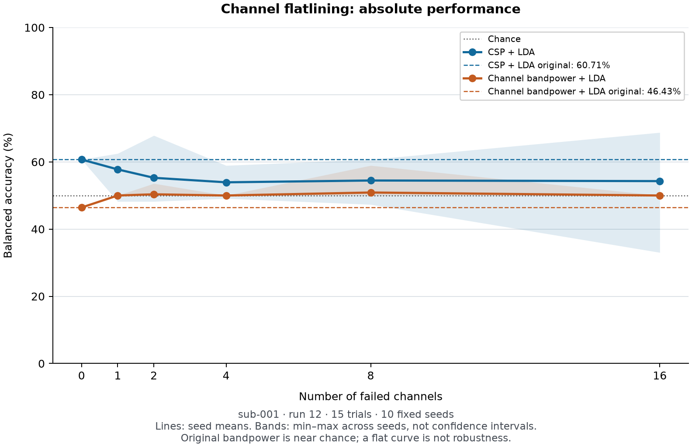
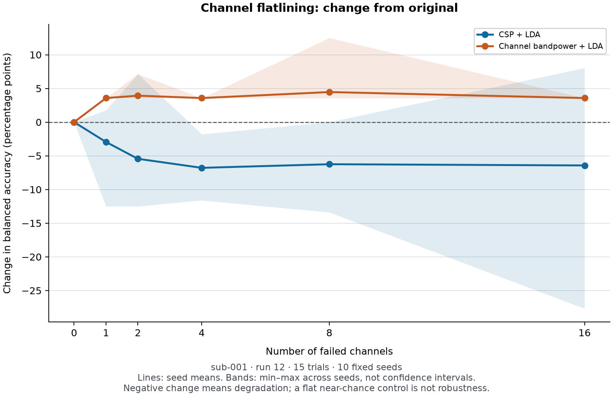

# sub-001: first frozen-decoder corruption experiment

**Both decoders collapse to a single predicted class at Gaussian severity
0.5 × training RMS and above.** CSP also loses balanced accuracy on average
under channel flatlining. The bandpower control's apparently flatter curve
mostly reflects constant-class predictions near chance, not useful robustness.

## Experiment run

Execution completed on 2026-10-05 using implementation commit
`f7987271cc725a368c86e2a7472063c4a3851638`, with a clean working tree, and the
[protocol frozen before stress evaluation](stress-protocol.md). The original
clean baseline was already known; no corruption results were used to select
settings. The pre-execution [review](stress-review.md) approved the implementation
with the interpretation limits below.

- **Training:** audited sub-001 runs 4+8, 30 trials. **Test:** run 12, 15 trials
  (7 left, 8 right), all 64 channels in original order/reference.
- Reconstructed both clean pipelines once, verified every saved learned array
  exactly, then kept both frozen. No hyperparameter tuning or corrupted-data refit.
- Unchanged 8–30 Hz causal Butterworth filtering, zero initial state per run,
  followed by half-open `[cue+1, cue+4)` windows: 480 samples at 160 Hz.
- Added independent Gaussian noise to the complete continuous test EEG in native
  µV, before filtering. Per-channel standard deviation was 0/0.25/0.5/1/2 times
  RMS pooled over all 40,000 unfiltered training samples, including rest and
  recorded offsets. Reused each seed's noise realization across amplitudes.
- Flatlined 0/1/2/4/8/16 uniformly sampled channels to zero throughout the
  continuous test recording; masks were nested within each seed.
- Seeds **0–9** for each family; both decoders saw the identical corrupted epochs.
  Total: **110 recording conditions, 220 decoder rows, 3,300 trial predictions**.
  The zero conditions repeat the same original trials; they are not extra data.

## Metrics

Balanced accuracy (BA) is the mean of left/right recall. Values below are **mean
± sample SD across ten seeds**, in percent. Delta is **stressed BA minus the same
decoder's original BA**, in percentage points; negative means degradation.
Because the original score is fixed, delta SD equals the displayed BA SD.
Seed SD/ranges describe perturbation variability on these same 15 trials and
are not confidence intervals over subjects or future trials.

| Gaussian severity (× RMS) | CSP BA (%) | CSP delta (pp) | Bandpower BA (%) | Bandpower delta (pp) |
| --- | --- | --- | --- | --- |
| 0 | 60.71 ± 0.00 | 0.00 | 46.43 ± 0.00 | 0.00 |
| 0.25 | 57.77 ± 4.42 | −2.95 | 58.21 ± 4.47 | +11.79 |
| 0.5 | 50.00 ± 0.00 | −10.71 | 50.00 ± 0.00 | +3.57 |
| 1 | 50.00 ± 0.00 | −10.71 | 50.00 ± 0.00 | +3.57 |
| 2 | 50.00 ± 0.00 | −10.71 | 50.00 ± 0.00 | +3.57 |

At 0.25 × RMS neither decoder is constant-class in any seed. At **each** of
0.5/1/2 × RMS, **10/10 seeds are constant-class for each decoder**: CSP predicts
left on all 15 trials, and bandpower predicts right on all 15. Both have BA 50%,
but accuracy is 46.67% for CSP and 53.33% for bandpower because class counts differ.
Their confusion matrices are respectively `[[7, 0], [8, 0]]` and
`[[0, 7], [0, 8]]`, with rows=true and columns=predicted in left/right order.
The apparent +3.57 pp bandpower change is therefore not an improvement in
discrimination. The low-noise score increase is descriptive and does not establish
a beneficial-noise effect or justify selecting a new operating condition.

| Failed channels | CSP BA (%) | CSP delta (pp) | Bandpower BA (%) | Bandpower delta (pp) | Constant-class seeds: CSP / bandpower |
| --- | --- | --- | --- | --- | --- |
| 0 | 60.71 ± 0.00 | 0.00 | 46.43 ± 0.00 | 0.00 | 0 / 0 |
| 1 | 57.77 ± 4.69 | −2.95 | 50.00 ± 0.00 | +3.57 | 0 / 10 |
| 2 | 55.27 ± 5.61 | −5.45 | 50.36 ± 1.13 | +3.93 | 1 / 9 |
| 4 | 53.93 ± 4.04 | −6.79 | 50.00 ± 0.00 | +3.57 | 3 / 10 |
| 8 | 54.46 ± 5.27 | −6.25 | 50.89 ± 2.82 | +4.46 | 0 / 9 |
| 16 | 54.29 ± 9.99 | −6.43 | 50.00 ± 0.00 | +3.57 | 3 / 10 |

Each constant-class count is out of ten seeds. With just one flatlined channel,
bandpower already predicts one class throughout every replicate (eight masks
give all-left, two all-right). CSP's mean declines with the first few failed
channels but is not strictly monotonic. At 16 failures its seed range is
**33.04%–68.75% BA**, illustrating dependence on the particular channel subset.

Full precision accuracy, BA, deltas, recalls, confusion counts and constant-class
flags are in [metrics.csv](metrics.csv) and [metrics.json](metrics.json).
[summary.csv](summary.csv) and [summary.json](summary.json) contain all means,
sample SDs, minima and maxima. [predictions.csv](predictions.csv) contains every
trial prediction and probability; [conditions.json](conditions.json) records
every failed-channel list and noise amplitude realization.

## Figures

These figures read only the frozen saved outputs. Lines show means and shaded
bands show seed minima/maxima, **not confidence intervals**. Absolute figures
retain the original baselines and 50% chance reference; delta figures use a
separate percentage-point scale. The Gaussian absolute curves overlap at 50%
from severity 0.5 onward because both decoders have collapsed.









Matching SVG versions are saved in [plots/](plots/).

## What this establishes and what it cannot establish

CSP is observably sensitive to these two synthetic perturbations on this
recording. The pipelines fail differently: at stronger Gaussian noise they
collapse to opposite classes; under even one channel flatline the bandpower
control consistently collapses while CSP retains varying predictions. Larger
CSP baseline-relative losses do **not** make bandpower the more robust useful
decoder: the bandpower baseline was only 46.43% BA, and both original scores
fell within their [clean permutation reference ranges](../clean-sub001/README.md).

The reviewer found no remaining execution blocker. Material concerns remain:

- **Only 15 held-out trials:** one changed left prediction moves BA by 7.14 pp;
  one right prediction by 6.25 pp. The differences are observable behavior on
  fixed trials, not established effects in future data. Ten noise/mask seeds
  do not supply additional participants or independent biological trials.
- **Flatline feature mismatch:** a zero channel produces the pre-existing
  log-power floor in the bandpower pipeline. Constant-class collapse is consistent
  with extreme feature extrapolation. This experiment does not separate lost
  information from training/test mismatch.
- **Raw RMS is not neural SNR:** the training scale includes offsets, rest,
  out-of-band energy and pre-existing artifacts. Filtering removes part of the
  injected broadband noise. Its amplitude definition is reproducible, but not
  a calibrated real-world artifact burden.
- **Attribution is limited:** the pipelines differ in dimension and spatial
  mixing; both use LDA covariance. Frozen CSP does not estimate new covariance
  during prediction. These comparisons do not isolate covariance as the cause.
- **Scope remains one within-session later run:** synthetic stationary corruption
  cannot establish general BCI fragility, cross-day/population robustness,
  realistic artifact frequency, or elapsed time to failure. No operating threshold
  or model setting was selected from these outcomes.

The single most informative next mechanism experiment is a **prespecified
known-fault training refit** of both pipelines using independently corrupted
training recordings, compared with the frozen-model results on independent
held-out data. Freeze fault conditions before new test outcomes are inspected;
do not chase the largest differences here. Recovery would support calibration
mismatch; persistent failure would still not prove irrecoverable information loss.

## Validation and reproduction

All **116 tests**, Ruff, and whitespace checks passed before execution. The
saved [baseline checks](baseline_checks.json) confirm exact clean configuration,
learned-array, epoch, prediction and metric equality. The [run checks](validation.json)
confirm unchanged source/training arrays, shared decoder inputs, frozen models,
and all 20 zero-corruption recording conditions. Protocol/reviewer snapshots,
audit references and clean-reference hashes were frozen before execution.

The [independent output review](../stress-output-review.md) subsequently
recomputed every metric and confusion matrix from all 3,300 saved predictions,
checked all 22 summaries, masks, scales and fingerprints, and found no
consistency blocker.

The full grid was repeated solely to verify determinism: **17 artifact files
matched byte-for-byte**, and metadata matched except its start timestamp.
Status timestamps necessarily differ. No intervening tuning or parameter change
was made. The pre-run integration review fixed a plotting-only floating-point
validation edge case; it did not change scores or decoding settings.

Exact [clean configuration](clean_config.json), [stress configuration](stress_config.json),
[training RMS vector](training_scale.json), [dataset manifest](dataset_manifest.json),
[split](split.json), and [code/package provenance](metadata.json) accompany the results.
Run from the repository root with cached data:

```sh
uv sync --locked
uv run --offline bci-stress stress \
  --config reports/stress-sub001/clean_config.json \
  --stress-config reports/stress-sub001/stress_config.json \
  --baseline reports/clean-sub001 \
  --output runs/reproduced-stress-sub001
uv run --offline python -m bci_stress.plot_stress runs/reproduced-stress-sub001
```

If recordings are not cached, first run `uv run bci-stress fetch` to download
and checksum-verify them. Use a new output directory; completed artifacts are
never overwritten by the runner.
